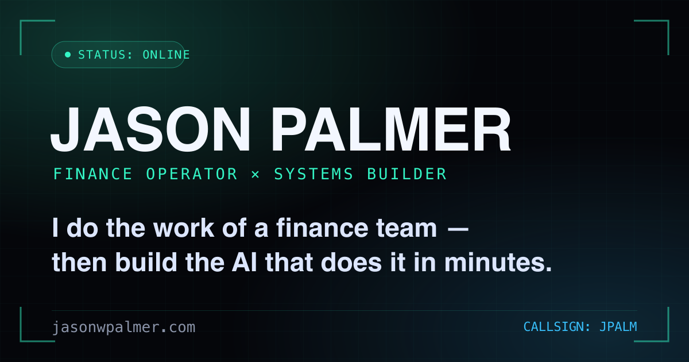

# jasonwpalmer.com

[](https://jasonwpalmer.com)
[](https://nextjs.org)
[](https://www.typescriptlang.org)

My personal site / live résumé — **[jasonwpalmer.com](https://jasonwpalmer.com)**.



A finance operator & systems builder's portfolio, styled as a cyberpunk "operator terminal" (boot sequence, HUD panels, live age/XP, build cards with rarity tiers). The tool showcase doubles as an always-current record of what I've built.

## Tech stack

- **Next.js 16** (App Router, React 19) — static export (`output: "export"`)
- **Tailwind CSS v4** + **TypeScript**
- **Cloudflare Pages** for hosting (zero server runtime)

## Structure

Content is data-driven — most edits happen in two files:

- `src/data/profile.ts` — bio, value pitch, stats, skills, experience, education, socials
- `src/data/tools.ts` — the build/tool showcase cards

Components live in `src/components/`; the page composition is `src/app/page.tsx`.

## Develop

```bash
npm install
npx next dev          # http://localhost:3000
```

## Build & deploy

```bash
npx next build                                              # -> ./out (static)
npx wrangler pages deploy out --project-name=jasonwpalmer-com
```

## Notes

- SEO: OpenGraph share card, JSON-LD `Person` schema, canonical URL, sitemap/robots.
- Privacy: the contact email is assembled client-side (no plain `mailto:` in the HTML) to defeat scrapers.
- Built and iterated with [Claude Code](https://claude.com/claude-code).

## License

© Jason Palmer. Code is provided for reference; please don't republish the site or its content as your own.
